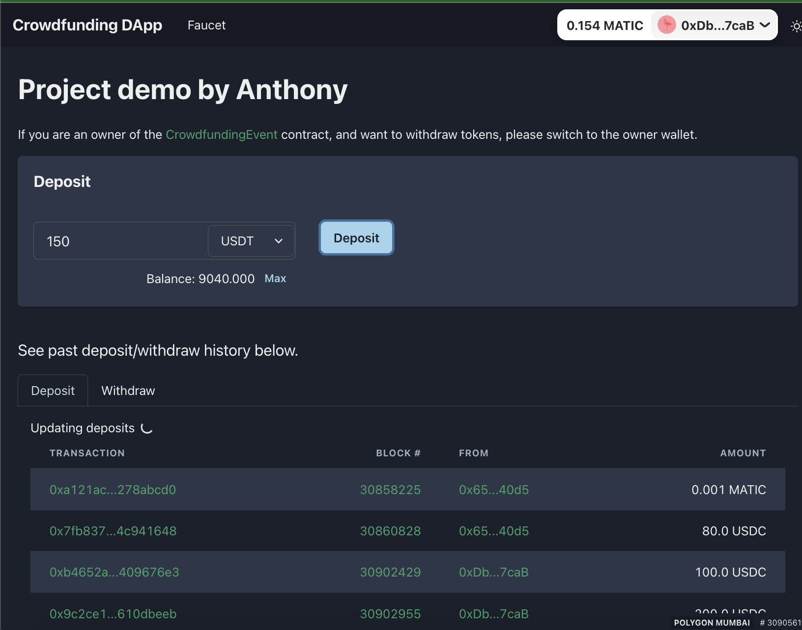
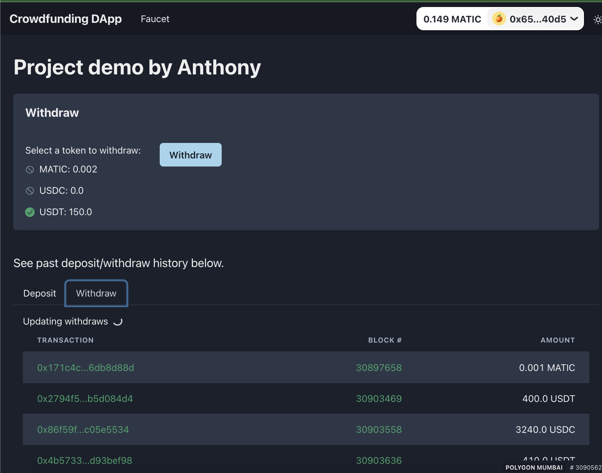
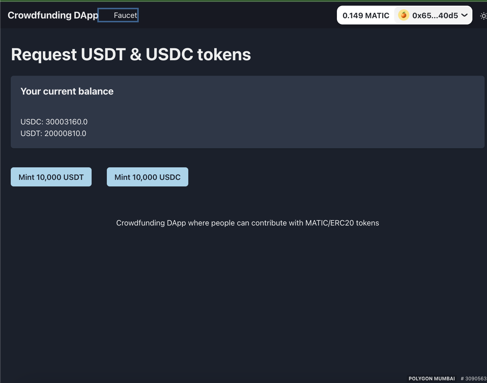

# Crowdfunding dApp

The dApp allows users to deposit funds using a smart contract, view the deposit and withdrawal history, and interact with the dApp through a user interface.

## Setup

This is a monorepo with yarn workspace based setup. It has 2 packages:

- [contracts](./packages/contracts/)

  Hardhat project. It provides 3 contracts - `CrowdfundingEvent`, `MockUSDT`, and `MockUSDC`

- [app](./packages/app/)

  Next.js based dApp.

## Tech spec

- Contracts

  - Solidity
  - Hardhat
  - OpenZeppelin

- App
  - Next.js
  - Ethers.js
  - Chakra UI
  - Wagmi
  - RainbowKit
  - SWR

## dApp

The app supports 3 tokens - MATIC (Native token), USDT (mock) and USDC (mock).

### Deposit

Connect your wallet, choose the token type to deposit, and input an amount.

You need to approve first to allow `CrowdfundingEvent` contract to transfer the selected amount of tokens.

Once approved or has enough allowance already, you can deposit tokens.

On the history section, click on Deposit and see if your deposit is showing up there.

### Withdraw

This is only available only to an owner of the `CrowdfundingEvent` contract.

Connect your wallet, and see the deposited token balance.

Choose a token to withdraw, and click withdraw. The all of available balance will be withdrawn. Watch yoru withdraw history on the Withdraw tab.

### Mint test ERC20 tokens

You will need to have test USDT & USDC tokens to deposit tokens other than native token.

Just connect your wallet and use the mint button to get specific ERC20 tokens.

## TODOs

- [ ] Contract unit tests
- [ ] Infinite scrolling in Deposit/Withdraw history
- [ ] Deposit/Withdraw instant updates
- [ ] ...
